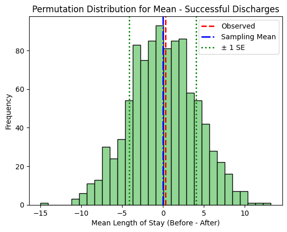
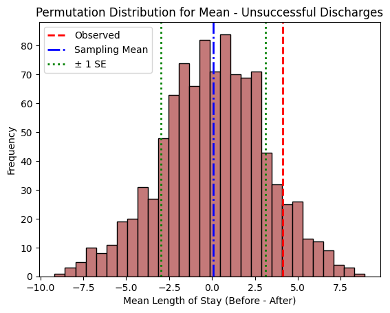
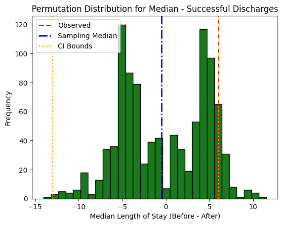
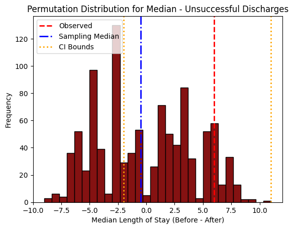

# The Cost of Change: Tracking Treatment Duration Through a 2025 Facility Reorganization

## 1. Research Question

_What are you investigating, and why does it matter?_

Wayside Recovery is a grant funded substance use treatment service provider located in the Twin Cities. In August 2025 it went through a re-organization due to budget cuts. Leadership is interested in how this organizational change has impacted client experience. 

The overall question is: Did the re-organization have an impact on the length of time clients stay in the program?

More specifically: Is there a difference between the median and average length of stay for successful and non-successful discharges in the six months before versus six months after the re-organization?

## 2. Hypothesis

_State your null and alternative hypotheses clearly and succinctly._

**Null hypothesis:**
    - There is no change in the length of stay for successful vs non-successful discharges between the six month period before and after the re-organization
  
**Alternative hypothesis:**
    - There is a change in the length of stay for successful vs non-successful discharges between the period before and after the re-organization. 

## 3. Data Description

_Describe your data source(s):_

_* Where it comes from (URL, API, dataset name)_ 
_* What each observation represents (unit of analysis)_ 
_* Number of observations and key variables_ 
_* Any filtering, cleaning, or transformation steps_

The data is from an electronic health record (EHR) system where discharge summaries are created and stored for each individual that leaves the program. Any information that could be used to identify individual clients has been stripped. 

Each observation represents a single treatment episode. There are clients that return to treatment multiple times due to the nature of substance use disorder. This analysis will take reoccurring clients into account by treating the subject ID as the grouping variable for the permutation test.

The total number of observations (n=243) include clients that have discharged from the program between March 2025 and February 2026. This allows for an equal 6 month comparison window surrounding the reorganization that occurred at the end of August 2025. The first period will include clients that discharged between March 1st, 2025 and August 31st, 2025. The second period includes clients that discharged between September 1st, 2025 and February 28th, 2026.

**Key variables:**
 - Subject ID (original identifiers have been replaced with synthetic subject IDs to protect client privacy)
 - Reason for discharge:
   - Completed Program
   - Patient left without staff approval
   - Patient conduct (behavioral)
   - Transferred to another program
   - Other 
     - The frequency of the "Transfer" and "Other" categories is low, so only "completed", "left without staff approval", and "behavioral" discharges will be included in the analysis.
 - Discharge Type (assigned based on 'Reason for Discharge')
   - Successful: includes clients marked as "completed Program"
   - Unsuccessful: includes clients in the "patient left without staff approval" and "patient conduct (behavioral)"
 - Intake date 
 - Discharge date 
 - Period (assigned based on discharge date)
   - Before = 6 month period before reorg
   - After = 6 month period after reorg
 - Length of stay (calculated column)
   - This is calculated as discharge date minus intake date PLUS one. This is done in the residential treatment setting as the client receives services the day they arrive on site. 

## 4. Methods

_Summarize how you analyzed the data:_

_* The test statistic for your permutation test_
_* How you simulated or resampled under the null hypothesis_
_* The metric(s) for which you created bootstrap confidence intervals_
_* Why the CLT does not apply to at least one metric_

The analysis divided the episodes by each discharge type (successful vs non-successful). The test statistic for the permutation test is the difference in the average and median length of stay in the period before the reorganization minus the average length of stay after the reorganization within each discharge category.

To sample under the null hypothesis, the period labels are shuffled by switching up the Subject IDs. This grouped approach ensures that the non-independence for clients who return to treatment is preserved throughout the analysis. With the grouped approach, if a client has multiple treatment episodes they are grouped together in the permutation and assigned the same period. 

Uncertainty is calculated with the Standard Error of the Difference formula for the permuations tests related to means. Bootstrap confidence intervals (95%) will be used to determine uncertainty for permutation tests related to medians. The metric is the difference in median length of stay between the 6 months before and after the reorganization. CLT does not apply to the median because it is not a proportion. 

## 5. Results

_Present your main findings:_

_* Key summary statistics and visualizations_
_* Observed test statistic and p-value (if applicable)_
_* Bootstrap confidence intervals for relevant metrics_

The results of the permutation analysis suggest that the re-organization has not yet produced a statistically significant change in the Length of Stay (LOS) for either successful or unsuccessful discharges. Across all four tests, the data consistently failed to reject the null hypothesis at the $\alpha = 0.05$ level, largely due to high variability within the population.

### Mean Length of Stay (Permutations #1 & #2)
These tests evaluated the change in the average length of stay in the period before vs the period after the re-organization. While the "Successful" group showed stability, the "Unsuccessful" group exhibited a visible, though non-significant, trend.

 

| Group | Test Stat (Mean Difference) | Observed Value |  p-value | Uncertainty (SE of Difference) |
|:---------------|:--------------|:---------------|:---------------|:---------------|
| Successful | $\overline{X}_{B} - \overline{X}_{A}$ | 0.31 days | 0.945 | ±4.08 |
| Unsuccessful | $\overline{X}_{B} - \overline{X}_{A}$ | 4.11 days | 0.181 | ±3.05 |

### Median Length of Stay (Permutations #3 & #4)
Switching to medians revealed larger absolute differences (6 days for both groups), but the high "noise" and wide confidence intervals prevented these findings from reaching statistical significance.

 

| Group | Test Stat (Median Difference) | Observed Value |  p-value | Uncertainty (Bootstrapped CI) |
|:---------------|:--------------|:---------------|:---------------|:---------------|
| Successful | $\tilde{x}_{B} - \tilde{x}_{A}$ | 6 days | 0.239 | [-13.00, 6.02] days |
| Unsuccessful | $\tilde{x}_{B} - \tilde{x}_{A}$ | 6 days | 0.181 | [-2.00, 11.00] days |

### Overall Findings
 - Stability in Success: For successful discharges, the mean length of stay is essentially unchanged (0.31-day difference). The larger 6-day median difference suggests that while the "average" is stable, the "typical" patient experience may be shifting, though high variance currently masks this.

 - Variability in Unsuccessful Discharges: Both mean (4.11 days) and median (6 days) tests for unsuccessful discharges show larger shifts than the successful group. However, the wide confidence intervals in these tests indicate that this population has high inherent variability, making it difficult to attribute changes specifically to the re-organization.

 - Conclusion: The re-organization has not significantly altered length of stay. The observed differences—particularly the 4.11 to 6-day shifts—likely represent "noise" or a "non-significant trend" that may require a larger sample size or a longer observation period to validate.

## 6. Uncertainty Estimation

_Discuss your resampling results:_

_* How many resamples you used_
_* What the bootstrap or randomization distributions looked like_
_* How you interpret the interval estimates_

 - **Resampling:** The analysis used 1,000 permutations for each test statistic. The null distribution was created by shuffling the "Period" labels (Before vs. After) across unique subject IDs. This approach maintains the exchangeability of the data while accounting for potential clustering within treatment episodes, ensuring that the resulting p-values are not deflated by clients who come back for additional treatment.

 - **Distribution Shape:** The permutation distribution for the mean differences was nearly symmetric with a bell-shaped curve, while the distribution of the median permutation appeared bi-modal and segmented. The difference in the shapes of the mean and median permutation distributions are due to the Central Limit Theorem applying to permutations for means. 
  
 - **Interval Estimates:** 
   - The Standard Error of the mean difference was used for the first two permutations.
     - The width of the interval was smaller for the permutation for successful discharges than the permutation for unsuccessful discharges. This means that there was less variability in discharge timeline for successful discharges.
     - The observed value for successful discharges fell within the first standard deviation, but for unsuccessful discharges the observed value was above the upper bound of the interval. This suggests that a change in length of stay for unsuccessful discharges has occured due to the re-organization, but it is not yet significant. On the other hand, the length of stay for successful discharges has not changed very much.
   - Bootstrapped confidence intervals were utilized to determine uncertainty for the difference in medians between the groups.
     - The width of the confidence intervals were wide for both the successful and unsuccessful groups. This indicates a high level of noise present in the underlying population and  suggests that the observed differences are due to roise rather than the re-organization.
     - Additionally, both observed differences in median length of stay fell within the 95% CI. 

## 7. Limitations

_Briefly note any limitations in data, assumptions, or methods, including sources of bias or missing data._

 - Mixed-exposure bias: Because this analysis focused on the clients that discharged in the 6 months before and after the reorganization, some of the clients included in the "after" phase were on site in the "before" phase.
 - Residual interdependence: Even with the grouped permutation test, treatment episodes are not truly independent and are influenced by many factors.
 - Right-Censoring: There is some right-censoring at the end of the after period because clients that admitted during the period but did not discharge until after the end date were not included. The mean and median length of stay for the "after" period are slightly underestimated due to this. 
 - Selection Bias: Because "transfer" and "other" discharge types were excluded; and "left without staff approval" and "patient conduct" were grouped together, this analysis is only generalizable to successful vs unsuccessful discharges. 
 - Confounding variables: the length of stay may have changed due to changes external to Wayside. For example, Operation Metro Surge occurred in the "after" phase which also could have plausibly affected the amount of time clients stayed on site. 

## 8. References

_List all datasets, tools, libraries, or papers you cited._

Data source:
 - Internal EHR data from Wayside Recovery

Software/Libraries:
 - Python
 - Pandas
 - Matplotlib/Seaborn
 - NumPy

---

**Reminder:** Your README should be clear enough that someone unfamiliar with your work could understand what you studied, how you analyzed it, and what you found.
